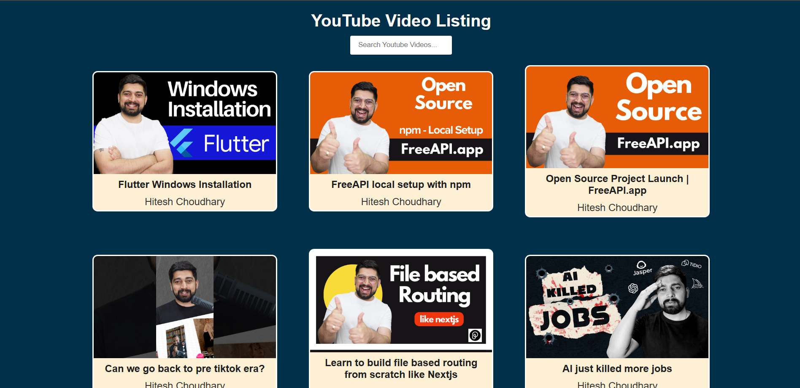

# YouTube Video Listing with Search

This is a simple web application that displays a list of YouTube videos fetched from a public API. It allows users to search for videos by title, and clicking on a video thumbnail will open the video on YouTube.

## Features
- Displays a list of YouTube videos with thumbnail, title, and channel name.
- Allows users to search videos by title.
- Click on a thumbnail to open the video on YouTube.

## Tech Stack
- **HTML**: Structure of the webpage.
- **CSS**: Styling of the webpage for a clean and responsive layout.
- **JavaScript**: Handles fetching YouTube video data, filtering search results, and dynamically displaying the videos.
- **Fetch API**: Used to retrieve video data from a public API.

## Live Demo
You can try the project live by visiting the following link:
- [Live Demo](https://chaicode-youtube-video-listing.vercel.app/)

## Screenshot

## How to Run the Project
1. Clone or download the repository.
2. Open `index.html` in your browser.
3. The YouTube video list will be fetched automatically, and you can search through the videos by typing in the search input.

## Project Structure
- `index.html`: The main HTML file that displays the content.
- `style.css`: The stylesheet for the project.
- `script.js`: The JavaScript file for fetching data, filtering results, and dynamically creating the video elements.

## API Source
The videos are fetched using the following API:
- **API**: [https://api.freeapi.app/api/v1/public/youtube/videos](https://api.freeapi.app/api/v1/public/youtube/videos)

## License
This project is open source and available under the [MIT License](LICENSE).
